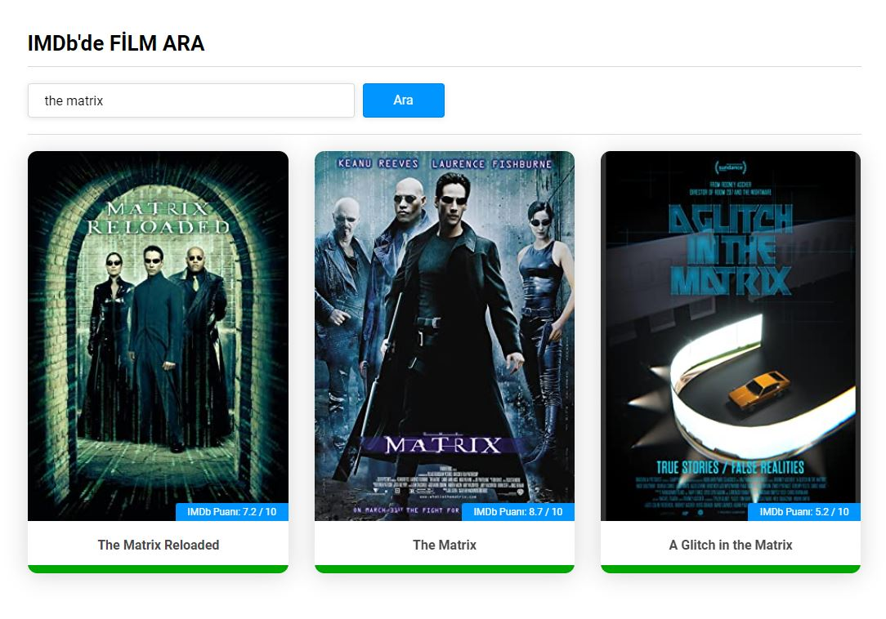

# Movie Search App with jQuery
## jQuery ile Film Arama Uygulaması

Yıllar önce HTML5, CSS3 ve jQuery teknolojileri ile geliştirdiğim ve OMDb API'ından sorgu yaparak filmleri listelediğim bir uygulama.

### Kullanım
OMDb Api key oluşturmak için https://www.omdbapi.com/apikey.aspx linkine gidin.
Generate API Key bölümünden API anahtarınızı oluşturup assets/js/common.js dosyasındaki ilgili alana ekleyin.

### English
An application that I developed years ago with HTML5, CSS3 and jQuery technologies and I list movies by querying the OMDb API.

### Usage
To create an api key, go to https://www.omdbapi.com/apikey.aspx.
Generate your API key from the Generate API Key section and add it to the relevant field below in the assets/js/common.js file.

<br><br>

```js
const api = {
	url : '//www.omdbapi.com',
	key : 'API_KEY',
	plot: 'full',
	type: 'movie'
};
```

<br><br>